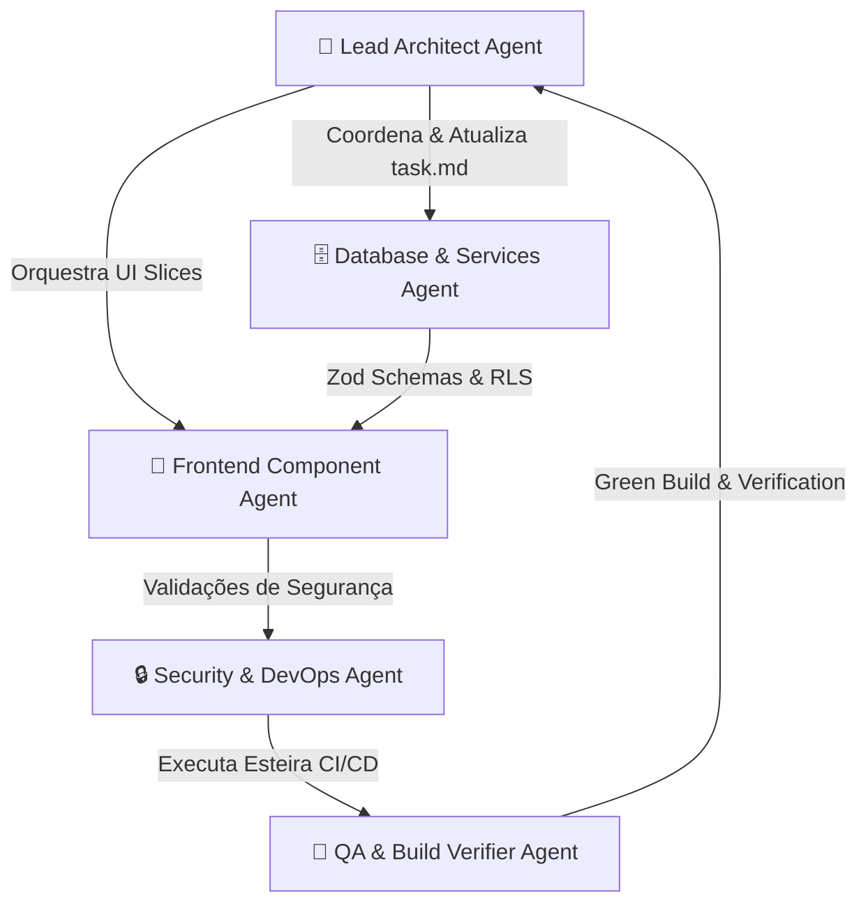

# Original User Request

## 2026-07-29T17:48:04Z

Refatoração completa do Focuserp de um modelo Document Store (JSONB) / useLocalStorageState para arquitetura relacional Supabase (PostgreSQL 3NF), com isolamento multi-tenant (tenant_id), segurança Keycloak/RLS, Zod schemas, React Query no frontend e pipeline CI/CD verificado.

Working directory: c:\Focuserp
Integrity mode: development

## Metaprompt de Orquestração Multi-Agente

## Subagentes & Papéis Específicos

1. **📐 Lead Architect Agent**
   - Coordenar a refatoração por módulo (Clientes ➡️ Financeiro ➡️ Projetos ➡️ RH).
   - Manter a integridade de task.md, implementation_plan.md e walkthrough.md.
   - Garantir a regra de ouro do Lovable: NUNCA executar git push --force ou git rebase.

2. **🗄️ Database & Services Agent**
   - DDL SQL Relacional 3NF: criar tabelas para tenants, users, clientes, contas_receber, contas_pagar, projetos, audit_logs com tenant_id.
   - Políticas RLS (Row Level Security) isolando dados por tenant_id extraído do JWT (Keycloak / Supabase Auth).
   - Criar Schemas Zod em src/schemas/ e serviços Supabase SDK em src/services/.

3. **🎨 Frontend Component Agent**
   - Refatorar componentes em src/features/* e src/components/*.
   - Substituir useLocalStorageState por hooks customizados @tanstack/react-query (useQuery, useMutation).
   - Manter 100% da UI/UX (Radix UI, Lucide Icons, TailwindCSS, feedback via sonner toast).

4. **🔒 Security & DevOps Agent**
   - Integrar/Validar JWT Keycloak e JWKS no Supabase Auth.
   - Manter a esteira .github/workflows/ci-cd.yml operacional e verificar segredos.

5. **🧪 QA & Build Verifier Agent**
   - Validação estática de tipos (npx tsc --noEmit) e compilação de produção (npm run build).
   - Garantir não-regressão, Ausência de vazamento de memória e RLS limpo.

## Requirements

### R1. Modelo Relacional & Supabase DDL (3NF)
Criar DDL completo para tabelas normalizadas (tenants, users, clientes, contas_receber, contas_pagar, projetos, audit_logs) substituindo a tabela legada focus_app_state. Habilitar RLS com políticas baseadas em tenant_id.

### R2. Camada de Validação Zod e Serviços SDK
Definir Zod Schemas fortemente tipados para todas as entidades em src/schemas/ e implementar serviços de CRUD/consultas via @supabase/supabase-js em src/services/.

### R3. Refatoração Frontend com React Query
Substituir todas as ocorrências de persistência em localStorage (useLocalStorageState) por React Query (@tanstack/react-query), mantendo feedback visual completo (spinners, toasts sonner, menus Radix UI).

### R4. Integração de Autenticação Keycloak & Segredos
Configurar validação de tokens JWT do Keycloak no Supabase Auth e assegurar que segredos e chaves sensíveis não fiquem expostos no repositório.

### R5. Validação Automática CI/CD e Build Verde
Garantir que a pipeline .github/workflows/ci-cd.yml funcione e que o projeto passe nos scripts npm run build e npx tsc --noEmit sem erros.

## Acceptance Criteria

### Banco de Dados & RLS
- [ ] DDL de tabelas relacionais em 3NF criado e testado.
- [ ] Políticas RLS configuradas garantindo isolamento estrito por tenant_id.

### Backend / Services / Schemas
- [ ] Schemas Zod definidos em src/schemas/ para todas as entidades.
- [ ] Serviços em src/services/ utilizando o Supabase JS SDK com tratamento de erros.

### Frontend UI / UX
- [ ] Todos os módulos (Clientes, Financeiro, Projetos, RH) migrados para useQuery / useMutation.
- [ ] useLocalStorageState removido ou descontinuado sem impactos visuais.
- [ ] Notificações de sucesso/erro mantidas com sonner.

### Build & Qualidade
- [ ] npx tsc --noEmit executa sem qualquer erro de tipagem.
- [ ] npm run build gera o bundle de produção com sucesso.
- [ ] NENHUM commit quebre o histórico do Lovable (sem rebase, amend ou force push).

## Follow-up — 2026-07-29T18:37:26Z

O usuário solicitou prosseguir ("prossiga"). Por favor, continue o processo de refatoração do Focuserp a partir da iteração 2 de correção do Marco 2 (Zod Schemas & Serviços Supabase SDK) e avance conforme o plano.

